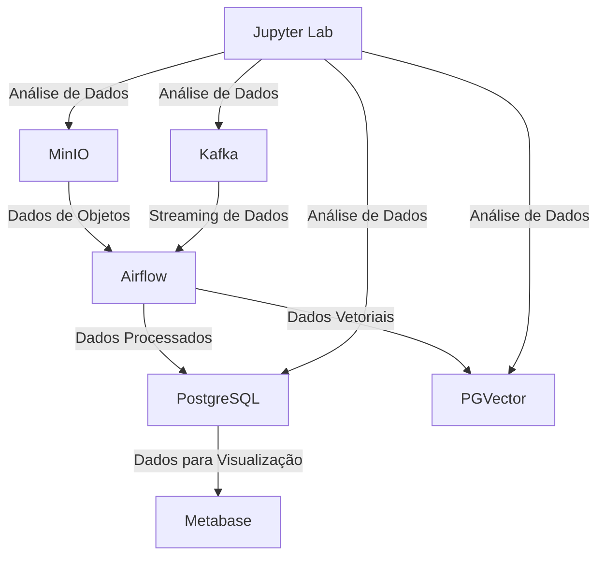

# Data Pipeline Terraform


**Data Pipeline Terraform** é uma prova de conceito (PoC) para a construção de um pipeline de dados moderno, utilizando ferramentas open-source e infraestrutura como código. O projeto combina **Terraform** e **Docker Compose** para configurar um ambiente completo de forma automatizada, ideal para aprendizado, experimentação e desenvolvimento de pipelines de dados.

Este projeto foi desenvolvido para demonstrar a integração de ferramentas populares em um ambiente local, simulando cenários reais de ingestão, armazenamento, processamento e visualização de dados. Ele é perfeito para estudantes, engenheiros de dados e entusiastas que desejam explorar um pipeline completo.

## Funcionalidades

-   **Infraestrutura como Código**: Terraform gerencia volumes e redes Docker.
-   **Armazenamento de Objetos**: MinIO simula o AWS S3.
-   **Mensageria**: Apache Kafka com Zookeeper para streaming de dados.
-   **Orquestração**: Apache Airflow para gerenciar pipelines.
-   **Bancos de Dados**:
    -   PostgreSQL para armazenamento relacional.
    -   PGVector para dados vetoriais.
-   **Visualização**: Metabase para análises e dashboards.
-   **Interface de Mensageria**: Kafka UI para monitoramento de tópicos.
-   **Análise de Dados**: Jupyter Lab com suporte a Python e bibliotecas de dados.

## Arquitetura

O projeto inclui os seguintes serviços, todos conectados via uma rede Docker (app-network):

1.  **MinIO**: Armazenamento de objetos compatível com S3.
2.  **Apache Kafka & Zookeeper**: Sistema de mensageria para streaming.
3.  **Apache Airflow**: Orquestração de pipelines de dados.
4.  **PostgreSQL**: Banco relacional com os bancos airflow, metabase data marts.
5.  **PGVector**: Banco vetorial para dados de embeddings.
6.  **Metabase**: Ferramenta de visualização open-source.
7.  **Kafka UI**: Interface para gerenciar clusters Kafka.
8.  **Jupyter Lab**: Ambiente interativo para análise de dados.
9.  **init-permissions**: Serviço auxiliar para configurar permissões do Airflow.



## Pré-requisitos

Para executar o projeto em uma máquina local com Ubuntu, você precisa:

-   **Ubuntu** (20.04 ou superior recomendado).
-   **Docker** (versão 20.10 ou superior).
-   **Docker Compose** (versão 2.0 ou superior).
-   **Terraform** (versão 1.5 ou superior).
-   **Git** (para clonar o repositório).
-   Pelo menos 8GB de RAM e 20GB de espaço em disco.

## Instalação e Configuração

Siga os passos abaixo para configurar o projeto do zero em uma máquina Ubuntu:

### 1\. Instalar Dependências

Atualize o sistema e instale as ferramentas necessárias:

```bash
sudo apt update && sudo apt upgrade -y
sudo apt install -y curl unzip git
```

#### Instalar Docker e Docker Compose

```bash
# Instalar Docker
sudo apt install -y docker.io
sudo systemctl start docker
sudo systemctl enable docker

# Adicionar usuário ao grupo docker
sudo usermod -aG docker $USER
newgrp docker

# Instalar Docker Compose
sudo curl -L "https://github.com/docker/compose/releases/latest/download/docker-compose-$(uname -s)-$(uname -m)" -o /usr/local/bin/docker-compose
sudo chmod +x /usr/local/bin/docker-compose
docker-compose --version
```

#### Instalar Terraform

```bash
# Baixar Terraform
wget https://releases.hashicorp.com/terraform/1.6.6/terraform_1.6.6_linux_amd64.zip
unzip terraform_1.6.6_linux_amd64.zip
sudo mv terraform /usr/local/bin/
terraform --version
rm terraform_1.6.6_linux_amd64.zip
```

### 2\. Clonar o Repositório

Clone o projeto do GitHub:

```bash
git clone https://github.com/marcelolimagomes/data-pipeline-terraform.git
cd data-pipeline-terraform
```

### 3\. Configurar Permissões

Crie os diretórios necessários e ajuste permissões para evitar erros (ex.: permissões do Airflow):

```bash
mkdir -p airflow-data/logs airflow-data/dags airflow-data/plugins dags scripts
sudo chown -R 1000:0 airflow-data dags
sudo chmod -R 775 airflow-data dags
```

### 4\. Criar Arquivo de Inicialização do PostgreSQL

Crie o arquivo `scripts/init.sql` para inicializar bancos no PostgreSQL:

```bash
cat <<EOF > scripts/init.sql
CREATE DATABASE metabase;
EOF
```

### 5\. Configurar Terraform

Inicialize e aplique a configuração do Terraform para criar volumes e redes:

```bash
cd terraform
terraform init
terraform apply -auto-approve
cd ..
```

Isso cria os volumes Docker (`minio-data`, `postgres-data`, etc.) e a rede `app-network`.

### 6\. Iniciar os Serviços

Execute o Docker Compose para subir todos os serviços:

```bash
docker compose up -d
```

O serviço `init-permissions` ajustará permissões do diretório `airflow-data` automaticamente.

### 7\. Verificar os Serviços

Confirme que todos os serviços estão rodando:

```bash
docker compose ps
```

Você deve ver os serviços `minio`, `kafka`, `zookeeper`, `airflow`, `postgres`, `pgvector`, `metabase`, `kafka-ui`, `jupyter`, e `init-permissions` (este último sai após executar).

### 8\. Acessar os Serviços

Use as URLs e credenciais abaixo para acessar cada serviço:

| Serviço     | URL                               | Credenciais             | Notas                                         |
|-------------|-----------------------------------|--------------------------|-----------------------------------------------|
| MinIO       | [http://localhost:9000](http://localhost:9000/) | minioadmin:miniopassword | Console em [http://localhost:9001](http://localhost:9001/) |
| Airflow     | [http://localhost:8080](http://localhost:8080/) | admin:admin              | Configurado com LocalExecutor                 |
| PostgreSQL  | localhost:5433                    | airflow:airflow          | Bancos: airflow, metabase, citech\_datamart    |
| PGVector    | localhost:5432                    | pgvector:pgvector        | Banco: vector\_db                              |
| Metabase    | [http://localhost:3000](http://localhost:3000/) | Configurar na primeira execução | Conecta ao banco metabase                     |
| Kafka UI    | [http://localhost:8081](http://localhost:8081/) | N/A                      | Monitora Kafka e Zookeeper                    |
| Jupyter Lab | [http://localhost:8888](http://localhost:8888/) | Token: mysecrettoken     | Inclui bibliotecas Python (boto3, kafka-python) |

Exemplo para conectar ao PostgreSQL:

```bash
psql -h localhost -p 5433 -U airflow -d airflow
```
### 9. Configurar DAGs no Airflow (Opcional)

Adicione suas DAGs ao diretório `dags/`:

```bash
touch dags/meu_pipeline.py
```

Edite `meu_pipeline.py` com seu código Airflow. Exemplo:

```python
from airflow import DAG
from airflow.operators.dummy import DummyOperator
from datetime import datetime

with DAG(
    'meu_pipeline',
    start_date=datetime(2025, 1, 1),
    schedule_interval=None
) as dag:
    task1 = DummyOperator(task_id='inicio')
    task1
```

As DAGs aparecerão automaticamente na interface do Airflow em [http://localhost:8080](http://localhost:8080/).

## Detalhes dos Serviços

### MinIO

-   **Imagem**: minio/minio:latest
-   **Função**: Simula o AWS S3 para armazenamento de objetos.
-   **Configuração**:
    -   Porta: 9000 (API), 9001 (console).
    -   Volume: minio-data para dados persistentes.
    -   Healthcheck: Verifica disponibilidade via /minio/health/live.
-   **Uso**: Armazene arquivos via API S3 ou interface web.

### Apache Kafka & Zookeeper

-   **Imagens**: confluentinc/cp-kafka:latest, confluentinc/cp-zookeeper:latest
-   **Função**: Sistema de mensageria para streaming de dados.
-   **Configuração**:
    -   Kafka: Porta 9092, conectado ao Zookeeper.
    -   Zookeeper: Porta 2181 para coordenação.
    -   Volumes: kafka-data, zookeeper-data.
-   **Uso**: Publique e consuma mensagens em tópicos Kafka.

### Apache Airflow

-   **Imagem**: apache/airflow:latest
-   **Função**: Orquestra pipelines de dados.
-   **Configuração**:
    -   Porta: 8080.
    -   Banco: PostgreSQL (airflow:airflow@postgres:5432/airflow).
    -   Volumes: airflow-data/logs, dags, airflow-data/plugins.
    -   Comando: Inicializa banco, cria usuário admin, e roda webserver/scheduler.
-   **Uso**: Crie DAGs em dags/ para automatizar tarefas.

### PostgreSQL

-   **Imagem**: postgres:16
-   **Função**: Banco relacional para Airflow, Metabase, e dados gerais.
-   **Configuração**:
    -   Porta: 5433:5432 (evita conflitos com PGVector).
    -   Bancos: airflow, metabase, citech\_datamart (via init.sql).
    -   Volume: postgres-data.
-   **Uso**: Armazene tabelas relacionais (ex.: citech\_datamart).

### PGVector

-   **Imagem**: ankane/pgvector:latest
-   **Função**: Banco para dados vetoriais (ex.: embeddings).
-   **Configuração**:
    -   Porta: 5432.
    -   Banco: vector\_db (pgvector:pgvector).
    -   Volume: pgvector-data.
-   **Uso**: Execute consultas vetoriais para aplicações de ML.

### Metabase

-   **Imagem**: metabase/metabase:latest
-   **Função**: Visualização de dados e criação de dashboards.
-   **Configuração**:
    -   Porta: 3000.
    -   Banco: Conecta ao PostgreSQL (metabase).
    -   Volume: metabase-data.
-   **Uso**: Crie relatórios a partir de citech\_datamart ou outros bancos.

### Kafka UI

-   **Imagem**: provectuslabs/kafka-ui:latest
-   **Função**: Interface para gerenciar clusters Kafka.
-   **Configuração**:
    -   Porta: 8081:8080.
    -   Conecta a kafka:9092 e zookeeper:2181.
    -   Volume: kafka-ui-data.
-   **Uso**: Monitore tópicos, consumidores, e produtores.

### Jupyter Lab

-   **Imagem**: Construída a partir de jupyter/datascience-notebook:latest
-   **Função**: Ambiente para análise de dados com Python.
-   **Configuração**:
    -   Porta: 8888.
    -   Dockerfile: Instala boto3, s3fs, kafka-python, psycopg2-binary, sqlalchemy.
    -   Volume: jupyter-data.
    -   Token: mysecrettoken.
-   **Uso**: Execute notebooks para interagir com MinIO, Kafka, PostgreSQL, etc.

### init-permissions

-   **Imagem**: alpine:latest
-   **Função**: Ajusta permissões do diretório airflow-data para o Airflow.
-   **Configuração**:
    -   Executa chmod -R 777 /airflow-data.
    -   Roda como root (user: "0:0").
-   **Uso**: Garante que o Airflow tenha acesso a logs e DAGs.

## Estrutura do Projeto

```
data-pipeline-terraform/
├── .env                 # Configura UID/GID do Airflow
├── Dockerfile           # Imagem personalizada do Jupyter
├── requirements.txt     # Dependências Python do Jupyter
├── docker-compose.yml   # Definição dos serviços
├── scripts/
│   └── init.sql         # Inicializa bancos PostgreSQL
├── dags/                # DAGs do Airflow
├── airflow-data/        # Logs, plugins, e configurações do Airflow
│   ├── logs/
│   ├── plugins/
│   └── airflow.cfg
├── jupyter/             # Contexto para build do Jupyter
└── terraform/           # Configurações do Terraform
    ├── main.tf
    └── variables.tf
```

## Possíveis Problemas e Soluções

-   **Permissões no Airflow**:
    -   Erro: `PermissionError: /opt/airflow/logs/scheduler`.
    -   Solução:
        ```bash
        sudo chown -R 1000:0 airflow-data
        sudo chmod -R 775 airflow-data
        docker compose up -d --force-recreate airflow
        ```
-   **Conflito de portas**:
    -   Erro: Porta 5432 ou 5433 em uso.
    -   Solução:
        ```bash
        sudo netstat -tuln | grep 5432
        sudo kill <PID>
        ```
-   **Metabase não conecta ao PostgreSQL**:
    -   Erro: `UnknownHostException: postgres`.
    -   Solução:
        ```bash
        docker compose up -d --force-recreate postgres metabase
        ```
-   **Imagem corrompida**:
    -   Solução:
        ```bash
        docker compose rm -f <serviço>
        docker rmi <imagem>
        docker compose up -d <serviço>
        ```

## Contribuindo

Contribuições são bem-vindas! Para contribuir:

1.  Fork o repositório.
2.  Crie uma branch (`git checkout -b feature/nova-funcionalidade`).
3.  Commit suas mudanças (`git commit -m "Adiciona nova funcionalidade"`).
4.  Push para a branch (`git push origin feature/nova-funcionalidade`).
5.  Abra um Pull Request.

## Licença

Este projeto é distribuído sob a licença MIT. Veja o arquivo LICENSE para mais detalhes (você pode precisar criar um arquivo LICENSE com o texto da licença MIT).

## Agradecimentos

-   À comunidade open-source por ferramentas incríveis como Terraform, Docker, Airflow, e Metabase.
-   Aos colegas que inspiraram esta PoC com ideias e feedback.

* * *